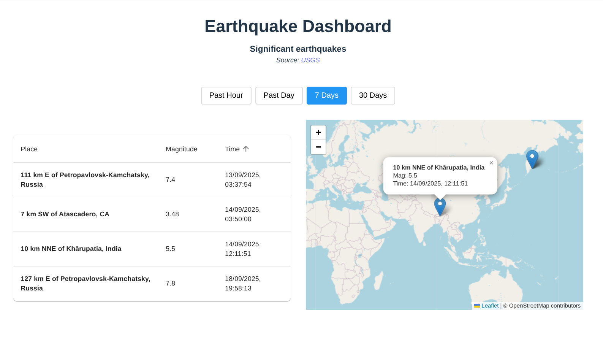
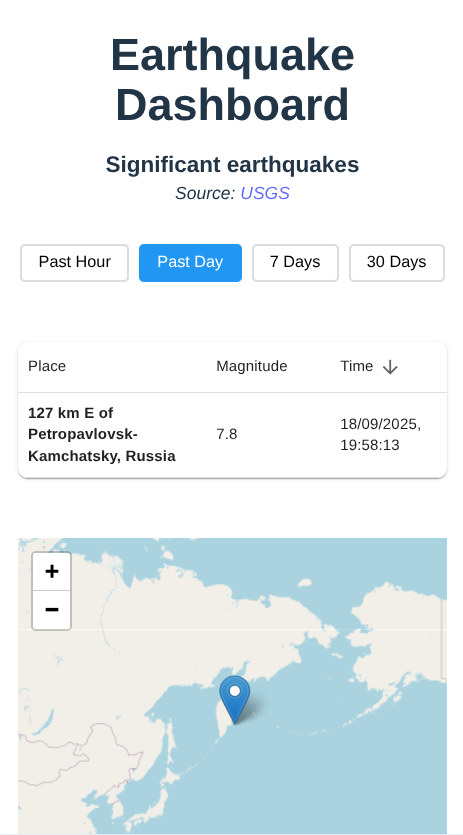

# Earthquake Monitoring App

<p align="center">
  
  <br />
  <br />
  
</p>

A React-based dashboard for monitoring significant earthquakes worldwide using real-time data from the USGS (United States Geological Survey).

## Quick Start

### Production Setup (Docker)
1. **Build the Docker image:**
   ```sh
   docker build -t monitoring-app .
   ```
2. **Run the container:**
   ```sh
   docker run -p 3000:3000 monitoring-app
   ```
3. **Access the app:**
   Open your browser and go to [http://localhost:3000](http://localhost:3000)

### Development Setup
1. **Install dependencies:**
   ```sh
   npm install
   ```
2. **Start development server:**
   ```sh
   npm run dev
   ```
3. **Access the app:**
   Open your browser and go to [http://localhost:5173](http://localhost:5173)

### Available Scripts
- `npm run dev` - Start development server with hot reload
- `npm run build` - Build for production
- `npm run preview` - Preview production build locally
- `npm run lint` - Run ESLint to check code quality

## Features

- **Real-time Earthquake Data**: Displays significant earthquakes from USGS feeds
- **Interactive Map**: Leaflet-based map with clickable earthquake markers
- **Sortable Table**: Material-UI table with sorting by place, magnitude, and time
- **Time Range Selection**: View earthquakes from the past day, week, or month
- **Responsive Design**: Optimized for both desktop and mobile devices

## Design and Implementation

### Table Implementation
- A **table layout** was chosen for the retrieved items to provide richer functionality
- **Material UI** was used to quickly implement interactive features and a modern interface with minimal custom code
- Built-in accessibility support includes keyboard navigation: `Tab` moves focus between headers, and `Enter` sorts by the selected column

### Performance Optimizations
- **Memoization** was used in the `EarthquakeList`, `EarthquakeMap`, and `TimeSelector` components to avoid unnecessary re-renders
- **Debounced Data Fetching**: Earthquake data is fetched with a 300ms debounce to prevent excessive network requests when the time range changes rapidly

## Documentation

📋 **[Project Assumptions and Limitations](./ASSUMPTIONS_AND_LIMITATIONS.md)** - Detailed documentation of application assumptions, current limitations, and future implementation considerations.

## Technology Stack

- **Frontend**: React 19, Material-UI, Leaflet
- **Build Tool**: Vite
- **Code Quality**: ESLint
- **Data Source**: USGS Earthquake API
- **Containerization**: Docker

## Browser Support

Modern browsers supporting ES6+ features, React hooks, and Leaflet mapping library.

---

*This application serves production-ready earthquake monitoring data using a minimal static server.*